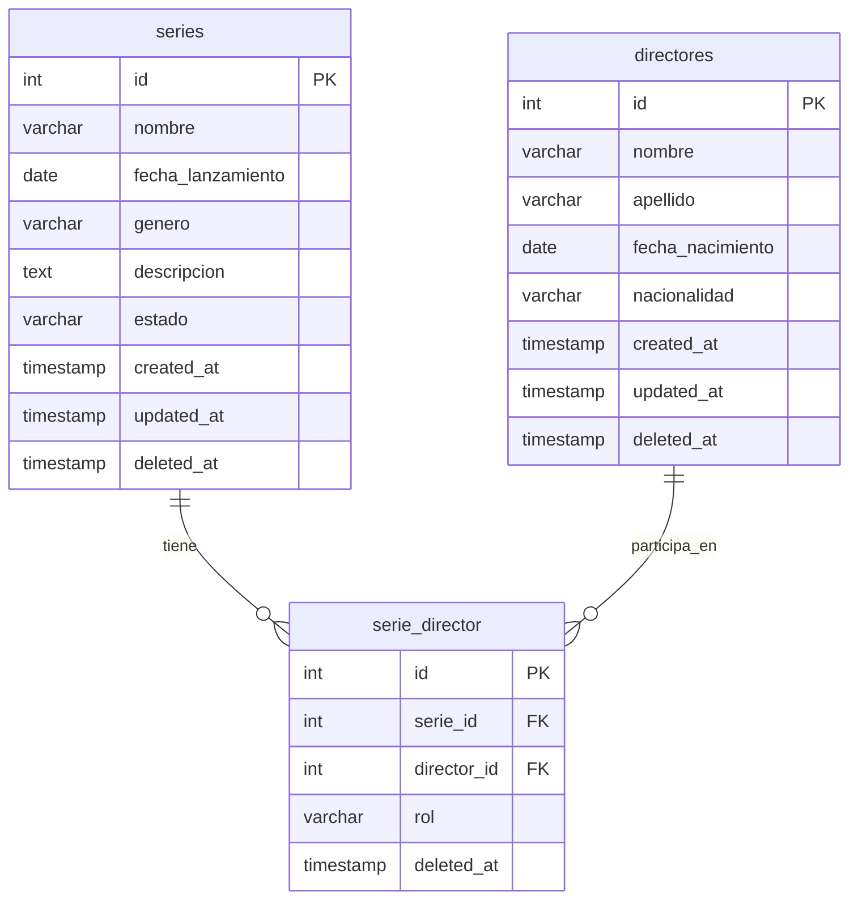

# PruebaOATI — Sistema de Registro de Series TV

Prueba técnica profesional para la Oficina Asesora de Tecnologías e Información (OATI) de la Universidad Distrital Francisco José de Caldas.

Aplicación full stack para registrar series de televisión y sus directores, con relación muchos a muchos, CRUD completo, soft delete y despliegue vía Docker.

## Stack tecnológico

| Capa          | Tecnología                                                     |
| ------------- | -------------------------------------------------------------- |
| Backend       | Python 3.12, FastAPI, SQLAlchemy 2.x, Alembic, Pydantic v2     |
| Frontend      | Angular 19 (standalone components), Reactive Forms, HttpClient |
| Base de datos | PostgreSQL 17                                                  |
| Contenedores  | Docker, Docker Compose                                         |
| API docs      | Swagger/OpenAPI autogenerado por FastAPI                       |

## Ejecución local (Docker)

**Requisito:** Docker Desktop en ejecución.

```bash
# 1. Clonar el repositorio
git clone https://github.com/FernandoCarretoC/PruebaOATI.git
cd PruebaOATI

# 2. Configurar variables de entorno
cp .env.example .env
# Editar .env si el puerto 5432 ya está ocupado (ej. POSTGRES_PORT=5435)

# 3. Levantar todos los servicios
docker compose up --build
```

### URLs locales

| Servicio          | URL                                               |
| ----------------- | ------------------------------------------------- |
| Frontend          | http://localhost:4200                             |
| Backend API       | http://localhost:8000/api                         |
| Swagger (OpenAPI) | http://localhost:8000/docs                        |
| Health check      | http://localhost:8000/api/health                  |
| PostgreSQL        | `localhost:${POSTGRES_PORT}` (por defecto `5432`) |

### pgAdmin (fuera de Docker)

Conéctate al Postgres expuesto por el contenedor:

- **Host:** `localhost`
- **Puerto:** valor de `POSTGRES_PORT` en `.env`
- **Usuario:** `POSTGRES_USER` (por defecto `oati`)
- **Contraseña:** `POSTGRES_PASSWORD`
- **Base de datos:** `POSTGRES_DB` (por defecto `series_db`)

## Variables de entorno

Copia [`.env.example`](.env.example) a `.env` en la raíz del proyecto:

| Variable            | Descripción                              | Ejemplo                 |
| ------------------- | ---------------------------------------- | ----------------------- |
| `POSTGRES_USER`     | Usuario de PostgreSQL                    | `oati`                  |
| `POSTGRES_PASSWORD` | Contraseña de PostgreSQL                 | `oati_secret`           |
| `POSTGRES_DB`       | Nombre de la base de datos               | `series_db`             |
| `POSTGRES_PORT`     | Puerto expuesto al host                  | `5432`                  |
| `BACKEND_PORT`      | Puerto del backend en el host            | `8000`                  |
| `FRONTEND_PORT`     | Puerto del frontend en el host           | `4200`                  |
| `CORS_ORIGINS`      | Orígenes permitidos (separados por coma) | `http://localhost:4200` |
| `DEBUG`             | Modo debug del backend (`true`/`false`)  | `true`                  |

El backend recibe `DATABASE_URL` construida automáticamente en `docker-compose.yml`. Referencia adicional en [`backend/.env.example`](backend/.env.example) para ejecución fuera de Docker.

## Estructura del proyecto

```
PruebaOATI/
├── docker-compose.yml
├── .env.example
├── backend/
│   ├── Dockerfile
│   ├── entrypoint.sh          # alembic upgrade head + uvicorn
│   ├── alembic/               # migraciones versionadas
│   └── app/
│       ├── main.py            # FastAPI, routers, exception handlers
│       ├── core/              # config, database, exceptions
│       ├── models/            # SQLAlchemy
│       ├── schemas/           # Pydantic
│       ├── repositories/      # queries puras
│       ├── services/          # lógica de negocio
│       └── routers/           # endpoints HTTP
├── frontend/
│   ├── Dockerfile             # multi-stage: build + nginx (local | production)
│   ├── nginx.conf             # SPA + reverse proxy /api/ (solo Docker Compose)
│   ├── nginx.prod.conf        # SPA sin proxy (Render)
│   └── src/app/
│       ├── core/              # services, models, interceptors
│       ├── features/          # series, directores
│       └── shared/            # confirm-dialog, error-toast, spinner
```

## Modelo de datos



**Soft delete:** las tres tablas usan `deleted_at`. Las consultas activas filtran `deleted_at IS NULL`.

**Índice único parcial** en `serie_director`: solo una asignación activa por par `(serie_id, director_id)`, permitiendo reactivar asignaciones soft-deleted.

## API — Endpoints

| Método   | Ruta                                        | Descripción                              |
| -------- | ------------------------------------------- | ---------------------------------------- |
| `GET`    | `/api/health`                               | Health check                             |
| `GET`    | `/api/series`                               | Listar series (con directores embebidos) |
| `GET`    | `/api/series/{id}`                          | Detalle de serie                         |
| `POST`   | `/api/series`                               | Crear serie                              |
| `PUT`    | `/api/series/{id}`                          | Actualizar serie                         |
| `DELETE` | `/api/series/{id}`                          | Soft delete de serie                     |
| `POST`   | `/api/series/{id}/directores/{director_id}` | Asignar director                         |
| `DELETE` | `/api/series/{id}/directores/{director_id}` | Desasignar director                      |
| `GET`    | `/api/directores`                           | Listar directores (con series embebidas) |
| `GET`    | `/api/directores/{id}`                      | Detalle de director                      |
| `POST`   | `/api/directores`                           | Crear director                           |
| `PUT`    | `/api/directores/{id}`                      | Actualizar director                      |
| `DELETE` | `/api/directores/{id}`                      | Soft delete de director                  |

Documentación interactiva completa en **http://localhost:8000/docs** (local) o **https://pruebaoati-backend.onrender.com/docs** (producción).

## Despliegue en producción (Render)

Tres servicios independientes (no se usa `docker-compose.yml` en Render):

| Servicio     | Tipo en Render        | URL |
| ------------ | --------------------- | --- |
| PostgreSQL   | Managed PostgreSQL    | _(interno — ver Render dashboard)_ |
| Backend      | Web Service (Docker)  | https://pruebaoati-backend.onrender.com |
| Frontend     | Web Service (Docker)  | https://pruebaoati-frontend.onrender.com |

**CORS en producción:** el backend debe incluir la URL del frontend en `CORS_ORIGINS`:

```
https://pruebaoati-frontend.onrender.com,http://localhost:4200
```

Si el frontend muestra **Http failure status 0**, casi siempre falta esa URL en `CORS_ORIGINS` del backend en Render.

## URLs de producción

| Servicio | URL |
| -------- | --- |
| **Frontend (entregable)** | https://pruebaoati-frontend.onrender.com |
| Backend API | https://pruebaoati-backend.onrender.com/api |
| Swagger | https://pruebaoati-backend.onrender.com/docs |
| Health check | https://pruebaoati-backend.onrender.com/api/health |

## Evidencia de funcionamiento

### Local (Docker Compose)

1. `docker compose up --build` levanta backend, frontend y PostgreSQL.
2. Frontend en http://localhost:4200 — CRUD de series y directores.
3. Asignación serie ↔ director desde ambos formularios.
4. Soft delete: registros ocultos en listados, visibles en BD con `deleted_at`.
5. Errores de API mostrados en toast (ej. serie inexistente → 404, asignación duplicada → 409).
6. Swagger en `/docs` para probar la API directamente.

### Producción (Render)

Verificado en junio 2026:

| Check | Resultado |
| ----- | --------- |
| Backend `/api/health` | 200 — `{"status":"ok"}` |
| CORS frontend → backend | `access-control-allow-origin: https://pruebaoati-frontend.onrender.com` |
| Frontend carga | 200 — https://pruebaoati-frontend.onrender.com |
| API `/api/series` y `/api/directores` | 200 — responden desde el frontend |
| Swagger público | https://pruebaoati-backend.onrender.com/docs |

Flujo funcional en producción: crear director → crear serie → asignar director → listar en ambas vistas → editar → eliminar (soft delete).

## Arquitectura del backend

Capas con responsabilidades separadas:

```
Router  →  Service  →  Repository  →  SQLAlchemy / PostgreSQL
```

- **Routers:** reciben HTTP, delegan al service, no contienen lógica de negocio.
- **Services:** orquestan repositories, lanzan excepciones de dominio.
- **Repositories:** queries SQLAlchemy puras; devuelven `None` o listas vacías si no hay resultados.

## Manejo de errores

### Backend

1. **Repositories** — no lanzan excepciones de negocio.
2. **Services** — lanzan excepciones de dominio (`SerieNotFoundError`, `DirectorYaAsignadoError`, etc.) definidas en `core/exceptions.py`.
3. **`main.py`** — handler global `@app.exception_handler(DomainError)` mapea a HTTP:

   ```json
   {
     "error": "SerieNotFoundError",
     "message": "Serie con id 999 no encontrada",
     "status_code": 404
   }
   ```

   - `*NotFoundError` → 404
   - `*YaAsignadoError`, `IntegridadReferencialError` → 409
   - Errores no controlados → 500 (sin stacktrace al cliente, sí en logs)

4. **Pydantic** — validación de formato → 422 automático.

### Frontend

- **`error.interceptor.ts`** — captura errores HTTP, extrae el mensaje del backend y lo muestra vía `NotificationService` (toast), sin `try/catch` repetido en cada componente.

## Desarrollo

### Migraciones (Alembic)

Al arrancar el contenedor backend, `entrypoint.sh` ejecuta `alembic upgrade head` automáticamente.

Para crear una nueva migración (con los contenedores levantados):

```bash
docker compose run --rm --no-deps -v "$(pwd)/backend:/app" backend \
  alembic revision --autogenerate -m "descripcion del cambio"
```

Verificar revisión aplicada:

```bash
docker compose exec backend alembic current
```

### Agregar un nuevo endpoint

1. Schema Pydantic en `backend/app/schemas/`
2. Métodos en `repository` (query pura)
3. Lógica en `service` (excepciones de dominio)
4. Ruta en `router` + registro en `main.py` si es router nuevo
5. Servicio HTTP en `frontend/src/app/core/services/`
6. Componente en `frontend/src/app/features/`

## Autor

Fernando Carreto — Prueba técnica OATI UD
